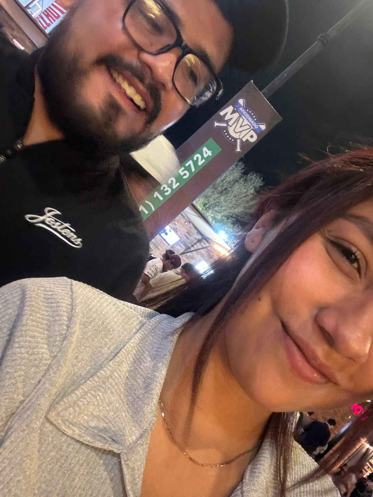

# Para Lili:
Página especial para lili

<!DOCTYPE html>
<html lang="es">
<head>
    <meta charset="UTF-8">
    <meta name="viewport" content="width=device-width, initial-scale=1.0">
    <title>Para Lili</title>
    
</head>
<body>
    

        
★

        
Lili, me gustas mucho, y no vas a dejar de gustarme ni un poquito.

        

        

            ✖
            
            <audio controls autoplay loop>
                <source src="amor_de_cine.mp3" type="audio/mpeg">
                Tu navegador no soporta el reproductor de audio.
            </audio>
            
Te amo

        

    

    
</body>
</html>
